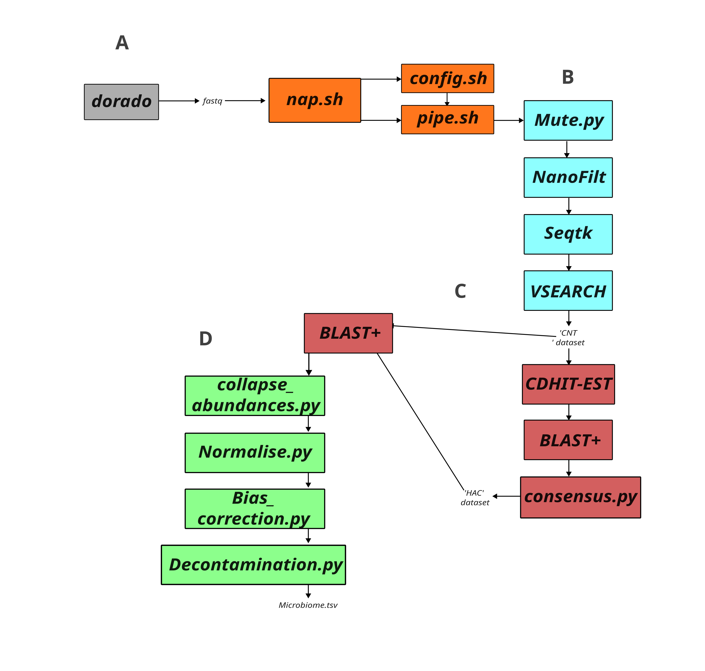

# **NAP — Nanopore sequencing-derived Amplicon Pipeline**
By **Luke B. Jones**



---

## **Requirements**

1. **Conda**
2. **Hardware:** A PC capable of handling large datasets (or alternatively, sufficient time).  
   Recommended: **>20 GB RAM** and a **CPU with >4 cores**.

---

## **How to set up**

```
# Clone the repository and set up NAP, refresh bashrc to ensure PATH is working
git clone https://github.com/Luke-B-Jones/NAP.git
cd ./NAP
./build.sh
source ~/.bashrc

# The conda environment should be named 'nap_env'.
conda env create -f environment.yaml

# If 'nap update-database' fails, check that your ~/.bashrc  
# has been correctly updated to include 'nap' as an alias.

# If you intend to use primers that are not default, skip this final step and see the User Manual (Parts 1 and 2).
conda activate nap_env
nap update-database SILVA_138.2_SSU_NR99
```

---

## **How to use**

**Always** ensure your project’s input data is stored in `./raw_data` before running any commands,  
unless you choose to modify the wrapper to suit your own directory structure.

```
# Example: Setting up contamination controls  
# (assumes ./raw_data/*13*.fasta corresponds to B1 - Blank 1)

nap pipe 13 B1 14 B2 15 B3
nap decon ./B1/B1*SPECIES-LEVEL.tsv ./B2/B2*SPECIES-LEVEL.tsv ./B3/B3*SPECIES-LEVEL.tsv
```

Once decontamination is enabled, proceed to data analysis.  
You can confirm this by checking `config.sh`:  
if the variable `blank_read_count` has content and `blank_active="1"`, you are ready to proceed.

```
# Example: Processing samples  
# (assumes ./raw_data/*13*.fasta corresponds to S1 - Sample 1)

nap pipe 3 S1 2 S2 1 S3
```

---

## **Interpretation**

1. **Pipe score:** Ranges from 0–100, calculated using Phred quality and read count.  
   Values **>90** are considered high-quality outputs.

2. Due to the nature of nanopore sequencing-based amplicons,  
   **low-abundance artefacts** may be present in any run scoring **<90**.

3. Assuming ~20% of reads are >Q30, we recommend a raw input of  
   **>500,000 reads per sample**.

---

## **User Manual**

### **1. Database setup**

The classification database is set up via the following process:

1. The user downloads the desired database.
2. `scripts/update-database` performs conserved processing steps, and  
   defers filtering to `scripts/mammalian_microbiome_inclusion.sh`, which by default removes:
   - uncultured entries  
   - metagenome-derived entries  
   - unclassified entries  
   - chlorophyll-derived sequences  
   - unlikely eukaryotes (for microbiome research)

3. Remaining reference reads are trimmed to isolate amplified regions,  
   using the primer configuration specified in `subconfigs/AMP*` (as set in `config.sh`).

Users wishing to use a different database should:

- examine how the database is annotated  
- update the `awk` commands in `scripts/mammalian_microbiome_inclusion.sh` (lines 21 and 29) accordingly  
- consider the classification conventions used by their chosen database

To configure a **new primer set**, users should:

1. Create a new subconfig:  
   `subconfigs/AMP_${primer_name}.sh`
2. Update `config.sh`:  
   `export amplicon_pre_set="${primer_name}"`
3. Re-run database setup.

---

### **2. Custom amplicons**

Custom amplicons are added by creating a new file in:

```
subconfigs/AMP*.sh
```

(where `*` is the primer name), and activating it in `config.sh` via:

```
amplicon_pre_set=""
```

Users should follow the template and guidance in:

```
subconfigs/AMP_template.sh
```

---

### **3. Using non-barcoded raw data**

Inside the `nap` wrapper (around line 99), the script extracts the path of a barcoded dataset  
based on the numeric identifier supplied on the command line.

Example:

```
nap pipe 14 S1
```

This instructs the pipeline to use:

```
./raw_data/*barcode14.fastq
```

as the raw input for sample `S1`.

Users with differently named raw data may safely modify this part of the wrapper.

---

## **Thanks to**

- **Morgan Cockrill (MSc, University of Bath)** — Improved robustness of `pipe` modules and QC section  
- **Josephine Ilott (MSc, University of Bath)** — Authored the decontamination Python module

