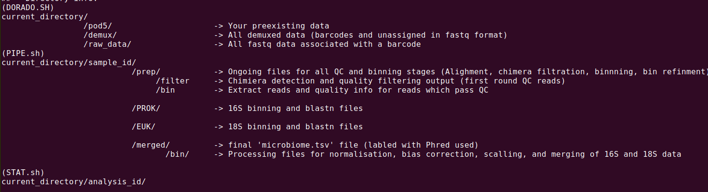

# ***NAP*** - Nanopore sequencing derived Amplicon Pipeline
By Luke B.Jones

## **Requirments**
(1) Docker

(2) PC capable of handleing large datasets (or alternatively, alot of free time), recommend >20GB RAM, GPU, and CPU with >4 cores

## **How to setup:**
(1 of 3) Clone repo, and setup docker
`````
git clone https://github.com/Luke-B-Jones/NAP.git
`````
`````
cd ./NAP
`````
`````
docker build --build-arg USER_NAME=$USER -t nap .
`````
(2 of 3) Activate your image, and get going...
`````
docker run -it -v /home/$USER/Documents:/home/$USER/Documents nap
`````
(3 of 3) Use NAP
`````
nap --help
`````
Optional: change the congif (Phred score, basecalling model...etc)
`````
nap configure -h
`````

## **How to use:**
(1) Basecall and demux (optional)
`````
# Recomend: update the config with your basecalling settings and use automatic (-a), ensure your in same direcotry as ./pod5/
'nap dorado -a/-m'
`````
Setup to automate the basecalling and demux (if needed) of samples. 
NOTE, if you intend to skip this, ensure your fastq files are in ./raw_data/ when running nap pipe.
(2) Process samples
`````
# NUM/PREFIX is unique identifier of your fastq, for example, if you demux and sample 1 is SQK-NBD114-24_barcode02.fastq, use 'nap pipe 02 1'
'nap pipe NUM/PREFIX ID'
`````
Once again, setup for automation, list samples you wish to process sequencually, including the fastq number and asscioted sample ID.


## **Directory info:**



## **THANKS TO:**
JAMES SWIFT (BSc University of Bath): STATISTICAL ANALYSIS R SCRIPTS (AVAILBE IN THE FUTURE THANKS)

MORGAN COCKRILL (Msc University of Bath): IMPROVING PIPE AND QC FUNCTIONALITY
